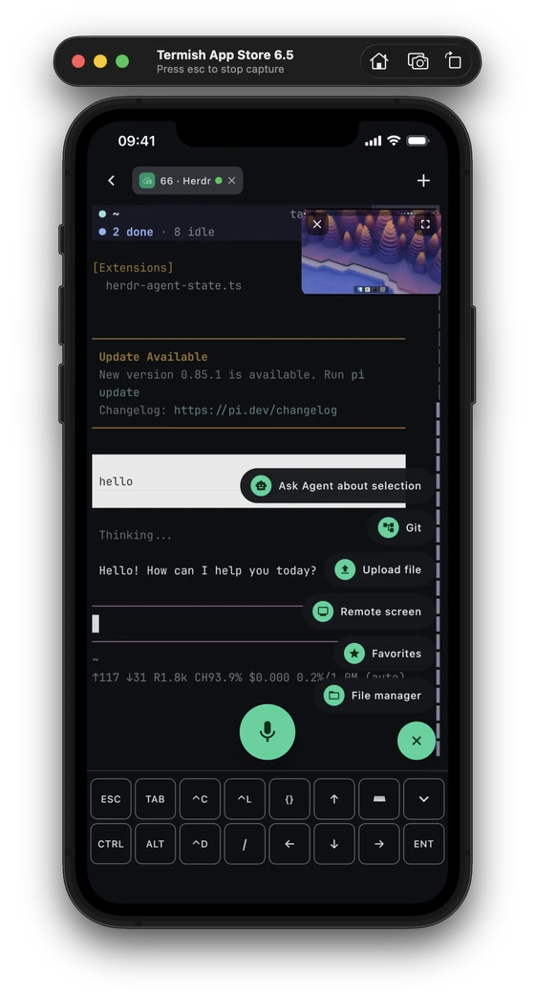
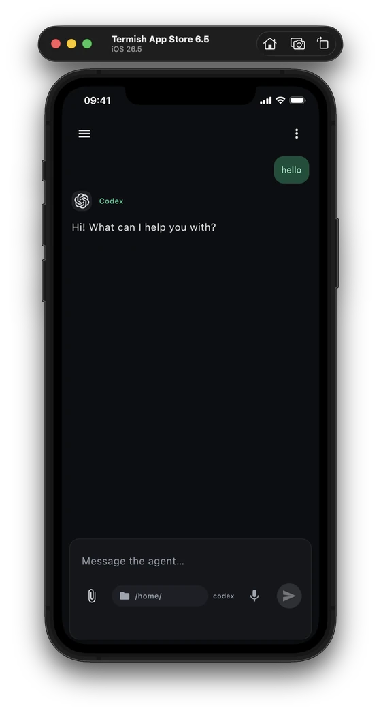
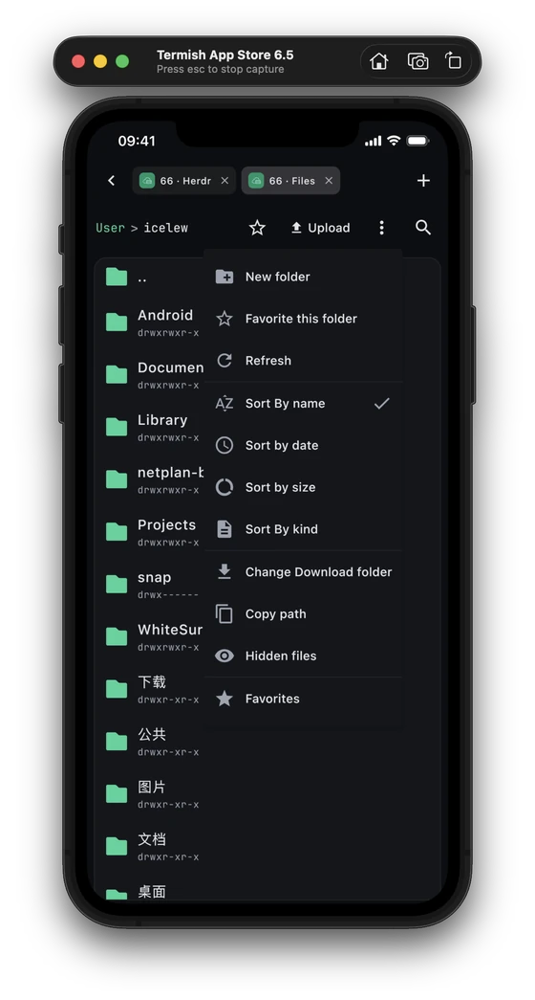

<p align="center">
  
</p>

<h1 align="center">Termish</h1>

<p align="center"><strong>Your remote workspace, in your pocket.</strong></p>
<p align="center">A terminal-first mobile workspace for the way you actually work: Termish → Herdr → Codex.</p>

<p align="center">
  <a href="https://download.termish.dev/downloads/termish.apk"><strong>Download Android</strong></a> ·
  <a href="CONTRIBUTING.md#ios">Build for iOS</a> ·
  <a href="https://termish.dev">Website</a> ·
  <a href="#quick-start">Quick start</a> ·
  <a href="README.zh-CN.md">简体中文</a>
</p>
<p align="center">
  <a href="https://github.com/ttermish/termish/releases/latest"></a>
  <a href="LICENSE"></a>
</p>

## Download

| Platform | Get Termish |
| --- | --- |
| Android 8.0+ | [Download the signed APK](https://download.termish.dev/downloads/termish.apk). Allow installation from this source when prompted. |
| iOS | Build with macOS and Xcode using the [iOS guide](CONTRIBUTING.md#ios). No public App Store download is available yet. |

[Release notes and all assets](https://github.com/ttermish/termish/releases/latest) · [SHA-256 checksums](https://download.termish.dev/downloads/SHA256SUMS)

<table>
  <tr>
    <th>Herdr + terminal</th>
    <th>Native Agent chat</th>
    <th>SFTP files</th>
  </tr>
  <tr>
    <td align="center"></td>
    <td align="center"></td>
    <td align="center"></td>
  </tr>
</table>
<p align="center"><sub>iOS presentation shared with <a href="https://termish.dev">termish.dev</a>. The terminal is the main workspace; native chat is an optional path.</sub></p>

## Quick start

1. **Add your host.** Open Hosts → `+`, enter the SSH address, username and
   password or private key. Verify the server's host key fingerprint on first connection.
2. **Open Herdr.** Use the **Herdr** entry on the host card. If it is not on the
   remote yet, Termish offers guided installation, then opens the workspace in
   the SSH or Mosh terminal.
3. **Keep coding in your terminal workflow.** Start Codex from Herdr, give it a
   task, follow its output, upload a screenshot or file when useful, inspect the
   result through the remote-screen window, then return to the terminal.
4. **Use native chat when it fits.** The **Agents** entry provides a phone-native
   conversation for Codex, Claude Code and other supported CLIs. It is an
   alternative interface, not a replacement for the Herdr terminal workspace.

For Agent chat, the remote host needs `python3` and the agent's own login or a
supported API provider configuration. Missing supported CLIs can be installed
from the app. You do not need a Termish account.

For Mosh, choose **Mosh** in the host's connection settings. The remote needs
`mosh-server` and a reachable UDP port; Termish offers guided installation when
the server is missing. Use a startup command such as `tmux new -A -s main` when
you want terminal programs to survive client disconnects.

## Why Termish?

| Capability | What you can do |
| --- | --- |
| **Terminal-first Herdr workspace** | Keep the familiar terminal workflow: enter Herdr, run Codex or Pi, switch workspaces and inspect live task output. Termish starts Herdr through SSH or Mosh and can guide its remote installation. |
| **Mobile development loop** | Give an agent a task, upload a screenshot or file, inspect diffs and remote files, open a live view of your Mac when you need to check the UI, then continue in the same terminal. |
| **SSH + Mosh sessions** | Open multiple terminal tabs and run tmux, vim, htop or any TUI. Mosh supports network roaming and local echo prediction for typing over slower connections. |
| **Optional native Agent chat** | Use Codex, Claude Code, Gemini CLI, OpenCode and Pi in a phone-native conversation. Follow streaming replies and tool calls, attach files, stop a task and resume conversations. |
| **Files and input built for phones** | Upload, download, search and organize files through SFTP. Use a CTRL / ALT / ESC toolbar, touch gestures and Chinese IME support in the terminal. |
| **Your hosts, your credentials** | Connect directly to your servers. Store saved secrets with Android Keystore or iOS Keychain. No Termish account, telemetry or hosted relay is required. |

Also included: Chinese and English UI, light and dark themes, terminal palettes,
quick commands, and live viewing of a Mac's screen over SSH after capture-service setup.

## How the main workflow works

Termish connects your phone directly to the development machine over SSH or
Mosh. The primary path is **Termish → Herdr → Codex**: Herdr and the coding
tool run on the remote machine, while the phone provides the terminal, input,
file transfer and a remote-screen view. A missing Herdr installation can be
prepared from the app. No Termish relay or account sits in the connection.

Native Agent chat is a separate option. It uploads the bundled Python Bridge
over SFTP and starts it for your remote user; the Bridge runs the selected agent
and relays messages through the authenticated SSH connection. No Docker, `pip`
setup or extra public listening port is needed. It keeps conversations on the
host and lets an active agent task continue while your phone is disconnected.

See the [Agent Bridge guide](agentBridge/README.md) for the protocol, supported
approval types and remote storage layout.

## Privacy and connection behavior

- **Direct connection:** Termish checks SSH host keys and stores saved credentials
  using platform security facilities. Agent conversations are persisted on your remote host.
- **Optional services:** configured AI and speech-recognition providers receive
  the content required for those features and may charge for usage. Termish's
  MIT license does not include a model subscription or API credits.
- **Background limits:** iOS suspends the app in the background; some Android
  devices also restrict background connections. Termish reconnects on return.
  Use tmux or Mosh for terminal continuity; the Agent Bridge owns its remote tasks.
- **Approvals:** availability depends on the agent's protocol. Unsupported
  interactive operations return an error rather than being silently approved.

[Privacy policy](docs/appstore/privacy-policy.md) · [Report a security issue](SECURITY.md)

## Build & Test

For Android, install JDK 17 and the Android SDK, then set `ANDROID_HOME` or the
SDK path in `local.properties`:

```bash
git clone https://github.com/ttermish/termish.git
cd termish
./gradlew :composeApp:assembleDebug
```

Debug builds do not need release signing keys. See [Contributing](CONTRIBUTING.md)
for unit and integration tests, iOS builds, and development conventions.

## Project and documentation

| Component | Source / guide |
| --- | --- |
| Mobile app | [Shared UI and platform code](composeApp/src) · [Architecture](docs/architecture.md) |
| Agent Bridge | [Python companion and protocol](agentBridge/README.md) |
| Terminal and input | [Terminal emulator](docs/terminal-emulator.md) · [Input pipeline](docs/input-pipeline.md) |
| Connections and files | [SSH](docs/ssh-transport.md) · [Mosh](docs/mosh.md) · [SFTP](docs/sftp.md) |
| Cryptography | [Implementation and threat model](composeApp/src/commonMain/kotlin/dev/termish/crypto/README.md) |
| Website | [termish.dev](https://termish.dev) · [Website repository](https://github.com/ttermish/termish-website) |

Built with Kotlin and Compose Multiplatform, a pure-Kotlin terminal and Mosh
client, sshj on Android, and libssh2 on iOS.

## Contributing and support

Bug reports, documentation improvements and pull requests are welcome in English
or Chinese. Read the [contribution guide](CONTRIBUTING.md) and
[code of conduct](CODE_OF_CONDUCT.md).

[Report a bug or request a feature](https://github.com/ttermish/termish/issues) ·
[Changelog](CHANGELOG.md) · [Contact](mailto:ttermish@gmail.com)

## License

Termish's original source code and documentation are available under the
[MIT License](LICENSE). Third-party components and bundled fonts retain their
own licenses; see [NOTICE](NOTICE) and [LICENSES](LICENSES/).
