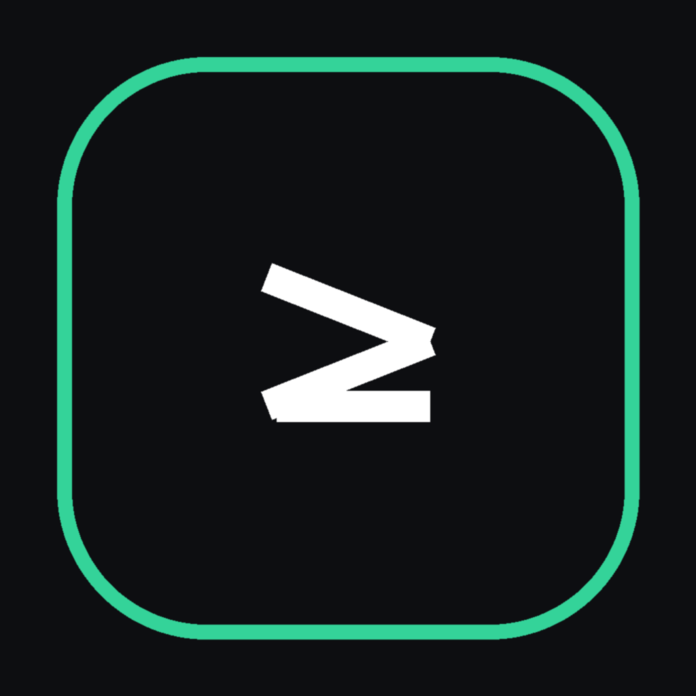
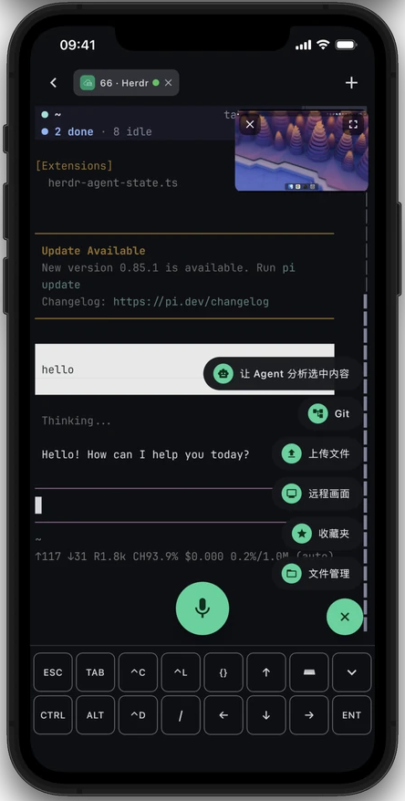
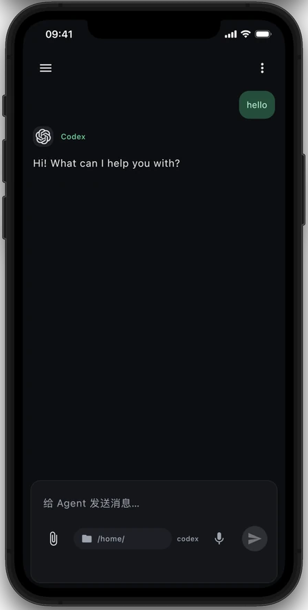
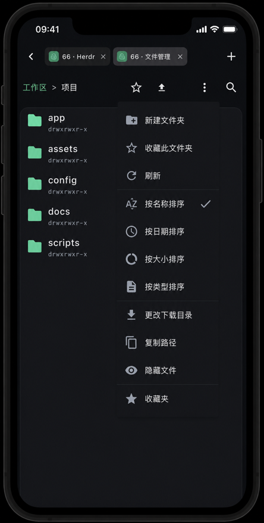

<p align="center">
  
</p>

<h1 align="center">Termish</h1>

<p align="center"><strong>远程工作，装进口袋。</strong></p>
<p align="center">终端优先的手机远程工作台：Termish → Herdr → Codex。</p>

<p align="center">
  <a href="https://download.termish.dev/downloads/termish.apk"><strong>下载 Android 版</strong></a> ·
  <a href="CONTRIBUTING.md#ios">构建 iOS 版</a> ·
  <a href="https://termish.dev">官网</a> ·
  <a href="#快速上手">快速上手</a> ·
  <a href="README.md">English</a>
</p>
<p align="center">
  <a href="https://github.com/ttermish/termish/releases/latest"></a>
  <a href="LICENSE"></a>
</p>

## 下载

| 平台 | 获取 Termish |
| --- | --- |
| Android 8.0+ | [下载签名 APK](https://download.termish.dev/downloads/termish.apk)，按系统提示允许从此来源安装应用。 |
| iOS | 使用 macOS 和 Xcode，按照 [iOS 构建指南](CONTRIBUTING.md#ios)运行。目前尚无公开的 App Store 下载入口。 |

[版本说明与全部安装包](https://github.com/ttermish/termish/releases/latest) · [SHA-256 校验和](https://download.termish.dev/downloads/SHA256SUMS)

<p align="center">
  
  
  
  
</p>
<p align="center"><sub><strong>Herdr + 终端 · 主工作区</strong> · 主机列表 · 原生 Agent 对话 · SFTP 文件。终端图中的悬浮小窗就是远程画面。四张图均采用与 <a href="https://termish.dev">termish.dev</a> 一致的 iOS 设备展示风格。</sub></p>

## 快速上手

1. **从主机列表开始。** 在「主机」页点击 `+`，填写 SSH 地址、用户名和密码或私钥。
   首次连接时核对服务器的主机密钥指纹。每台主机都能直接打开远程终端、Herdr、文件管理、远程画面或 Agent 对话。
2. **进入 Herdr。** 从主机菜单点击 **Herdr**。远程未安装时，Termish 会提供引导安装，
   完成后在 SSH 或 Mosh 终端中打开工作区。
3. **沿用终端工作流开发。** 在 Herdr 里启动 Codex，描述任务、查看执行输出；需要时上传截图或文件，
   通过远程画面查看实际界面，然后回到终端继续操作。
4. **需要时再用原生聊天。** 主机卡片上的 **Agent** 入口提供 Codex、Claude Code 等 CLI 的手机原生对话。
   它是另一种操作界面，不替代 Herdr 终端工作区。

Agent 聊天需要远程主机配置 Agent 自身的登录或受支持的 API 服务商。
缺少受支持的 CLI 时，可在应用内安装。无需注册 Termish 账号。

使用 Mosh 时，在主机连接设置中选择 **Mosh**。远程需要 `mosh-server` 和可访问的 UDP 端口；
服务缺失时，Termish 会提供引导安装。希望终端程序在客户端断开后继续运行，可以配置
`tmux new -A -s main` 等启动命令。

## 为什么选择 Termish？

| 核心能力 | 可以做什么 |
| --- | --- |
| **主机列表与会话** | 将直连 SSH、Mosh 主机集中管理；从主机进入远程终端、Herdr、文件管理、远程画面或 Agent 对话，并在重连前看到仍在运行的会话。 |
| **终端优先的 Herdr 工作区** | 保留熟悉的终端工作方式：进入 Herdr，运行 Codex 或 Pi，切换工作区并查看实时任务输出。Termish 通过 SSH 或 Mosh 启动 Herdr，缺失时可在手机上引导安装。 |
| **远程画面** | 以悬浮小窗或全屏查看远程桌面；通过触控或虚拟鼠标检查和操作桌面应用，与终端或 Herdr 并行使用。 |
| **手机上的开发闭环** | 提出任务、上传截图或文件、查看差异和远程文件，然后回到同一终端继续操作。 |
| **SSH + Mosh 会话** | 打开多个终端标签，运行 tmux、vim、htop 或任意 TUI。Mosh 支持网络漫游与本地回显预测，改善高延迟连接下的输入体验。 |
| **可选的原生 Agent 聊天** | 在手机原生对话界面使用 Codex、Claude Code、Gemini CLI、OpenCode 和 Pi；查看流式回答与工具调用、添加附件、停止任务和继续历史会话。 |
| **适合手机的文件与输入** | 通过 SFTP 上传、下载、搜索和整理远程文件；终端提供 CTRL / ALT / ESC 快捷工具栏、触屏手势和中文输入法支持。 |
| **自己的主机与凭据** | 直连服务器，保存的密钥由 Android Keystore 或 iOS Keychain 保护。无需 Termish 账号，无遥测，也无需托管中转服务。 |

还提供中英文界面、深浅色主题、终端配色和快捷命令。

## 主工作流如何运行

手机通过 SSH 或 Mosh 直连开发机。从**主机列表**进入后，主路径是
**Termish → Herdr → Codex**：Herdr 和编码工具运行在远程机器，手机提供终端、输入、传文件和远程画面。
远程没有 Herdr 时，可直接在 App 内引导安装。整个连接中没有 Termish 中转服务，也不需要注册账号。

原生 Agent 聊天是另一条可选路径：应用通过 SFTP 上传内置 Rust Bridge，并以远程用户身份启动；
Bridge 运行你选择的 Agent，消息通过已认证的 SSH 连接传输。无需 Docker，
也无需额外开放公网监听端口。会话保存在远程主机上，手机断开后正在运行的 Agent 任务仍可继续；
重新连接即可打开历史会话。

远程画面使用带部署版本的电脑端服务，运行在图形登录会话中，由 App 引导安装并通过 SSH 访问。
独立源码、配置与诊断方式详见 [远程画面服务文档](docs/screen-service.md)。
手机通过 SSH/SFTP 上传预编译 Rust 服务，支持 macOS 和 Linux（X11/Wayland）
的 arm64、x86_64 架构；电脑端无需安装 Rust 编译器。
macOS 后台应用名为 **Termish Helper**，使用 Termish 图标；录屏与辅助功能权限分别授予此应用。
菜单栏可查看连接状态、暂停/恢复访问、断开连接、打开权限设置、重启服务、查看日志与退出。

协议、支持的审批类型和远程存储目录详见 [Agent Bridge 文档](agentBridge/README.md)。

## 隐私与连接行为

- **直连主机：** Termish 校验 SSH 主机密钥，通过平台安全机制保存凭据。Agent 会话持久化在你的远程主机上。
- **可选外部服务：** 配置的模型和语音识别服务会接收使用该功能所需的内容，也可能按用量收费。
  Termish 的 MIT 授权不包含模型订阅或 API 额度。
- **后台限制：** iOS 进入后台后会挂起应用，部分 Android 设备也会限制后台连接。
  返回应用时会重新连接；终端持久会话可配合 tmux 或 Mosh，Agent 的远程任务则由 Bridge 管理。
- **审批支持：** 取决于 Agent 自身的协议。不支持的交互操作会返回错误，不会被静默批准。

[隐私政策](docs/appstore/privacy-policy.md) · [报告安全问题](SECURITY.md)

## 构建与测试

Android 开发需要 JDK 17、Android SDK 与 rustup 管理的 Rust，在 `ANDROID_HOME` 或 `local.properties` 中设置 SDK 路径：

```bash
git clone https://github.com/ttermish/termish.git
cd termish
./gradlew :composeApp:assembleDebug
```

Debug 构建不需要发布签名密钥。单元与集成测试、iOS 构建步骤和开发约定见 [贡献指南](CONTRIBUTING.md)。

## 项目与文档

| 组成部分 | 源码 / 文档 |
| --- | --- |
| 移动应用 | [共享界面与平台代码](composeApp/src) · [架构](docs/architecture.md) |
| Agent Bridge | [Rust 伴随服务与协议](agentBridge/README.md) |
| 终端与输入 | [终端模拟器](docs/terminal-emulator.md) · [输入管线](docs/input-pipeline.md) |
| 连接与文件 | [SSH](docs/ssh-transport.md) · [Mosh](docs/mosh.md) · [SFTP](docs/sftp.md) |
| 加密 | [实现与威胁模型](composeApp/src/commonMain/kotlin/dev/termish/crypto/README.md) |
| 官网 | [termish.dev](https://termish.dev) · [官网仓库](https://github.com/ttermish/termish-website) |

基于 Kotlin 与 Compose Multiplatform，共享纯 Kotlin 终端和 Mosh 客户端；
Android 使用 sshj，iOS 使用 libssh2。

## 参与贡献与反馈

欢迎用中文或英文提交问题、改进文档和贡献代码。请阅读 [贡献指南](CONTRIBUTING.md)
和 [行为准则](CODE_OF_CONDUCT.md)。

[报告问题或提出建议](https://github.com/ttermish/termish/issues) ·
[更新日志](CHANGELOG.md) · [联系我们](mailto:ttermish@gmail.com)

## 许可证

Termish 原始源码与文档采用 [MIT 许可证](LICENSE)。第三方组件及内置字体保留各自的许可证，
详见 [NOTICE](NOTICE) 与 [LICENSES](LICENSES/)。
