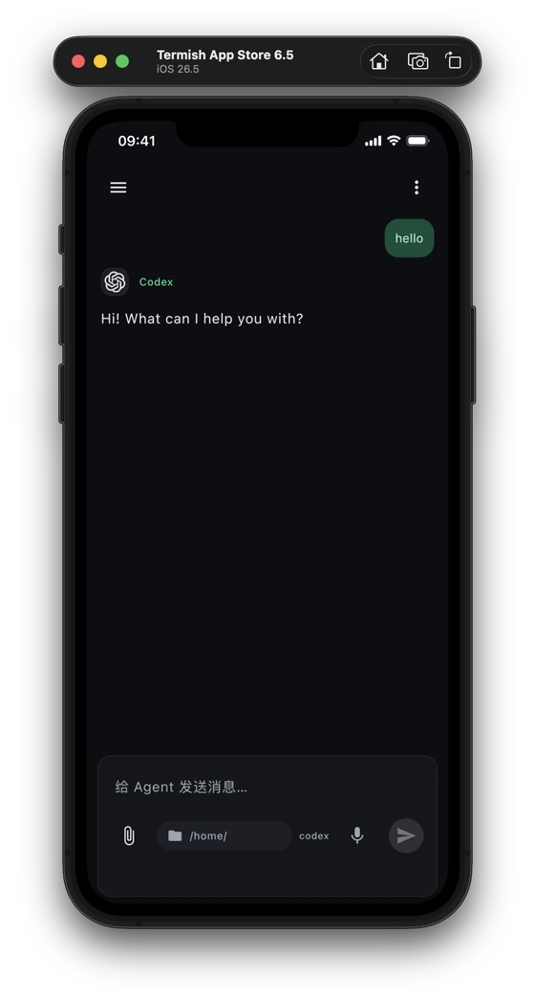
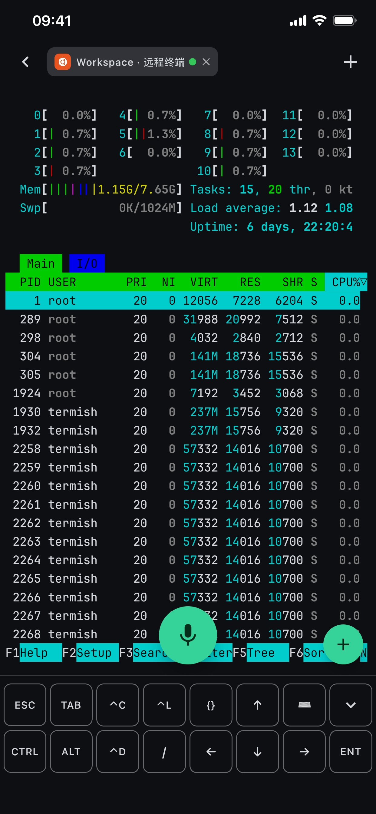
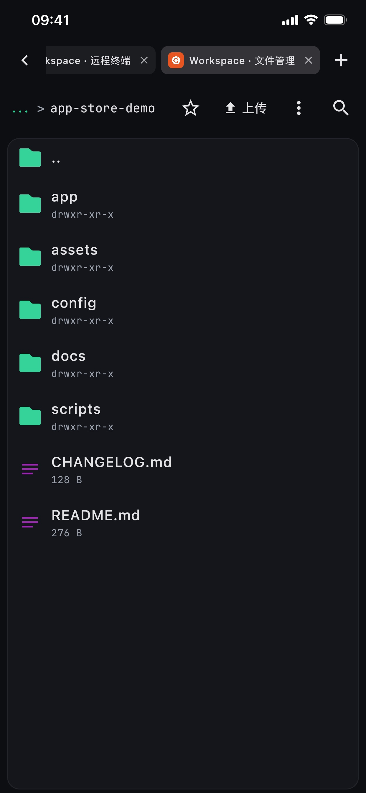

<p align="center">
  
</p>

<h1 align="center">Termish</h1>

<p align="center"><strong>手机上的 AI 编程助手与 SSH / Mosh 终端。</strong></p>
<p align="center">随时与 Codex、Claude Code 等 Agent 对话，打开终端、管理文件，在自己的服务器上继续工作。</p>

<p align="center">
  <a href="https://download.termish.dev/downloads/termish.apk"><strong>下载 Android 版</strong></a> ·
  <a href="CONTRIBUTING.md#ios">构建 iOS 版</a> ·
  <a href="https://termish.dev">官网</a> ·
  <a href="#快速上手">快速上手</a> ·
  <a href="README.md">English</a>
</p>
<p align="center">
  <a href="https://github.com/ttermish/termish/releases/latest"></a>
  <a href="LICENSE"></a>
</p>

## 下载

| 平台 | 获取 Termish |
| --- | --- |
| Android 8.0+ | [下载签名 APK](https://download.termish.dev/downloads/termish.apk)，按系统提示允许从此来源安装应用。 |
| iOS | 使用 macOS 和 Xcode，按照 [iOS 构建指南](CONTRIBUTING.md#ios)运行。目前尚无公开的 App Store 下载入口。 |

[版本说明与全部安装包](https://github.com/ttermish/termish/releases/latest) · [SHA-256 校验和](https://download.termish.dev/downloads/SHA256SUMS)

<table>
  <tr>
    <th>Agent 对话</th>
    <th>SSH / Mosh 终端</th>
    <th>SFTP 文件管理</th>
  </tr>
  <tr>
    <td align="center"></td>
    <td align="center"></td>
    <td align="center"></td>
  </tr>
</table>
<p align="center"><sub>以上为 iOS 版截图。</sub></p>

## 快速上手

1. **添加主机。** 在「主机」页点击 `+`，填写 SSH 地址、用户名和密码或私钥。
   首次连接时核对服务器的主机密钥指纹。
2. **选择工作方式。** 点击主机卡片上的 **Agent** 入口进入原生聊天，点击主机打开终端，
   或在 `+` 菜单选择 **通过 SFTP 连接**。
3. **开始任务。** 在 Agent 页面按提示配置 Bridge，选择 Agent 和远程工作目录后发送消息。
   可以添加附件、查看工具执行过程、处理受支持的审批请求，也可以从历史列表继续聊天。

Agent 聊天需要远程主机安装 `python3`，并配置 Agent 自身的登录或受支持的 API 服务商。
缺少受支持的 CLI 时，可在应用内安装。无需注册 Termish 账号。

使用 Mosh 时，在主机连接设置中选择 **Mosh**。远程需要 `mosh-server` 和可访问的 UDP 端口；
服务缺失时，Termish 会提供引导安装。希望终端程序在客户端断开后继续运行，可以配置
`tmux new -A -s main` 等启动命令。

## 为什么选择 Termish？

| 核心能力 | 可以做什么 |
| --- | --- |
| **原生 Agent 聊天** | 使用 Codex、Claude Code、Gemini CLI、OpenCode 和 Pi。查看流式回答与工具调用、添加附件、停止任务、继续历史会话；切换聊天时，发送与审批仍对应原来的会话。 |
| **SSH + Mosh** | 打开多个终端标签，运行 tmux、vim、htop 或 Agent TUI。Mosh 支持网络漫游与本地回显预测，改善高延迟连接下的输入体验。 |
| **SFTP 文件管理** | 上传、下载、搜索和整理远程文件；传输文件夹、收藏常用路径、预览文本与 Markdown。 |
| **适合手机的输入** | CTRL / ALT / ESC 快捷工具栏、触屏手势与中文输入法支持。配置自己的语音识别服务后，还可以使用语音输入。 |
| **自己的主机与凭据** | 直连服务器，保存的密钥由 Android Keystore 或 iOS Keychain 保护。无需 Termish 账号，无遥测，也无需托管中转服务。 |

还提供中英文界面、深浅色主题、终端配色、快捷命令，以及配置采集服务后通过 SSH 实时查看 Mac 屏幕。

## 工作原理

手机通过 SSH 连接你的主机。首次使用原生 Agent 聊天时，应用通过 SFTP 上传内置的 Python Bridge，
并以远程用户身份启动。Bridge 运行你选择的 Agent，消息通过已认证的 SSH 连接传输。
无需 Docker、`pip` 配置，也无需额外开放公网监听端口。

Bridge 将会话保存在远程主机上，手机断开连接后，正在执行的 Agent 任务可以继续运行；
重新连接即可打开历史会话。同时仍可使用 SSH / Mosh 终端和 SFTP。

协议、支持的审批类型和远程存储目录详见 [Agent Bridge 文档](agentBridge/README.md)。

## 隐私与连接行为

- **直连主机：** Termish 校验 SSH 主机密钥，通过平台安全机制保存凭据。Agent 会话持久化在你的远程主机上。
- **可选外部服务：** 配置的模型和语音识别服务会接收使用该功能所需的内容，也可能按用量收费。
  Termish 的 MIT 授权不包含模型订阅或 API 额度。
- **后台限制：** iOS 进入后台后会挂起应用，部分 Android 设备也会限制后台连接。
  返回应用时会重新连接；终端持久会话可配合 tmux 或 Mosh，Agent 的远程任务则由 Bridge 管理。
- **审批支持：** 取决于 Agent 自身的协议。不支持的交互操作会返回错误，不会被静默批准。

[隐私政策](docs/appstore/privacy-policy.md) · [报告安全问题](SECURITY.md)

## 构建与测试

Android 开发需要 JDK 17 和 Android SDK，在 `ANDROID_HOME` 或 `local.properties` 中设置 SDK 路径：

```bash
git clone https://github.com/ttermish/termish.git
cd termish
./gradlew :composeApp:assembleDebug
```

Debug 构建不需要发布签名密钥。单元与集成测试、iOS 构建步骤和开发约定见 [贡献指南](CONTRIBUTING.md)。

## 项目与文档

| 组成部分 | 源码 / 文档 |
| --- | --- |
| 移动应用 | [共享界面与平台代码](composeApp/src) · [架构](docs/architecture.md) |
| Agent Bridge | [Python 伴随服务与协议](agentBridge/README.md) |
| 终端与输入 | [终端模拟器](docs/terminal-emulator.md) · [输入管线](docs/input-pipeline.md) |
| 连接与文件 | [SSH](docs/ssh-transport.md) · [Mosh](docs/mosh.md) · [SFTP](docs/sftp.md) |
| 加密 | [实现与威胁模型](composeApp/src/commonMain/kotlin/dev/termish/crypto/README.md) |
| 官网 | [termish.dev](https://termish.dev) · [官网仓库](https://github.com/ttermish/termish-website) |

基于 Kotlin 与 Compose Multiplatform，共享纯 Kotlin 终端和 Mosh 客户端；
Android 使用 sshj，iOS 使用 libssh2。

## 参与贡献与反馈

欢迎用中文或英文提交问题、改进文档和贡献代码。请阅读 [贡献指南](CONTRIBUTING.md)
和 [行为准则](CODE_OF_CONDUCT.md)。

[报告问题或提出建议](https://github.com/ttermish/termish/issues) ·
[更新日志](CHANGELOG.md) · [联系我们](mailto:ttermish@gmail.com)

## 许可证

Termish 原始源码与文档采用 [MIT 许可证](LICENSE)。第三方组件及内置字体保留各自的许可证，
详见 [NOTICE](NOTICE) 与 [LICENSES](LICENSES/)。
